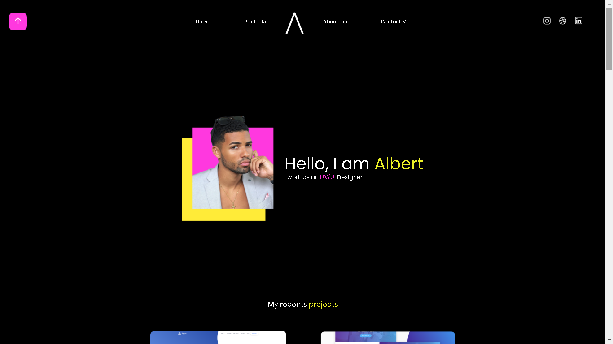
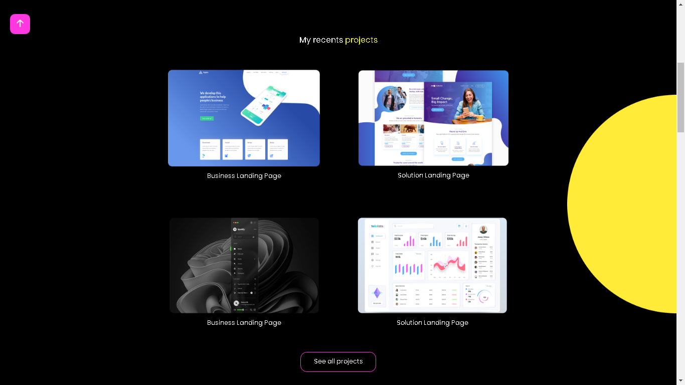
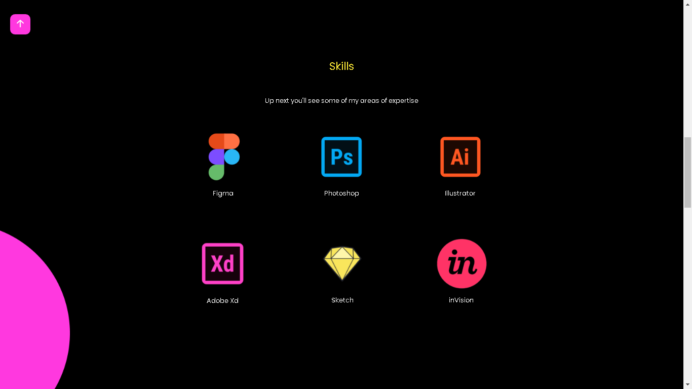
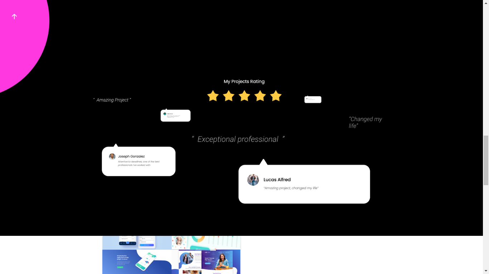
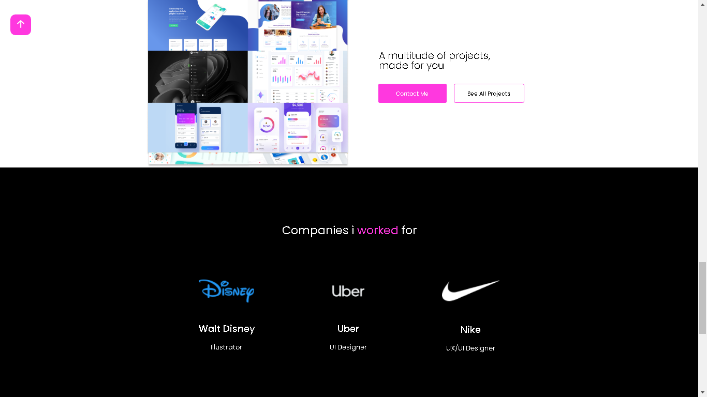
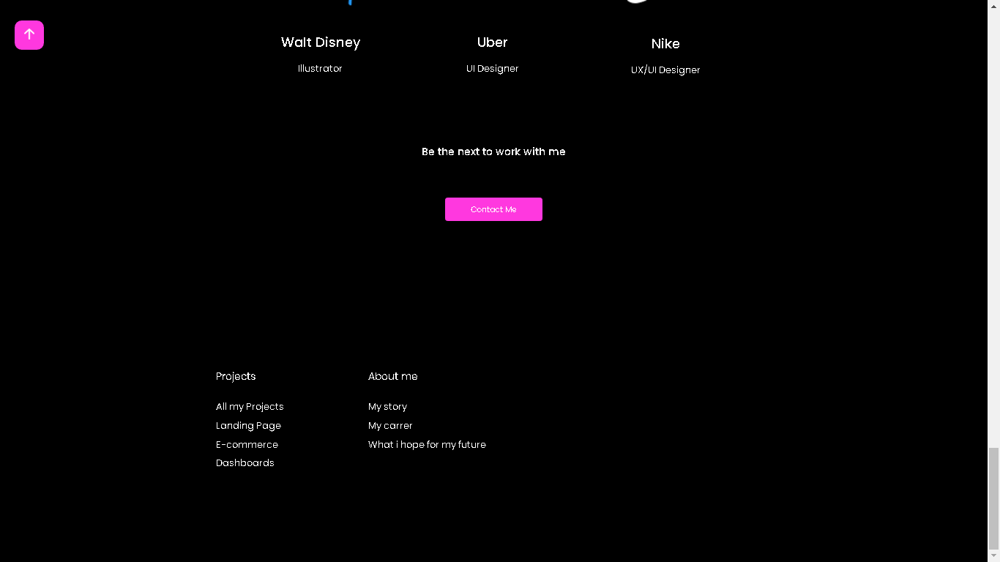

## 👀 Overview
 
 <h3>Uma estrutura de modelo para a criação de um portifólio HTML5 | CSS3 | JavaScript</h3>

 
 
<h3 align="center">Apresentation Area</h2> 
 

 
<h3 align="center">Projects Area</h3> 
 

 
<h3 align="center"> Skills Area</h3>
 

 
<h3 align="center"> Contact Me</h3>
 

 
<h3 align="center">Companies </h3> 
 

 
<h3 align="center">Footer</h3> 
 

 

## 💡 Ideia

O projeto é uma codificação de um UI Design que eu mesmo fiz. A ideia era criar uma estrutura simples que permitisse que toda a atenção fosse voltada ao conteúdo.

- Design
 
O Design foi pensado para criar um portifólio moderno com cores bem fortes para chamar a atenção, algumas coisas foram mudadas do Design para a codificação.
 

- Estrutura
 
Criada em HTML, assim como o Design foi pensando na melhor opção para que fosse responsivo e simples, a maior parte do site foi criado com CSS-FLEXBOX.
 

- Acessibilidade
 
O projeto está completamente responsivo, mas ainda precisa de alguns ajustes em algumas unidades de medidas para resoluções específicas.
 

 

## ⚙️ Tools

 - HTML
 - CSS
 - JAVASCRIPT
 - FIGMA

 
 

## 🚀 Future

- Código
 
Penso em criar mais abas além da HOMEPAGE, mas isso deve acontecer caso eu resolvar recriar este site em react ou quem sabe em um futuro próximo 😋
 
 
- Utilização
 
O projeto me ajudou a melhorar a minha noção de UX/UI e claro, entender um pouco mais sobre wireframes. Com certeza meu portifólio será inspirado em alguns elementos deste projeto.

 
 
 
<h3 align="center"> Criado com muito ❤️ por <a href="https://github.com/VBrianB"> Vinicius Brian Bolzani</a></h2>
